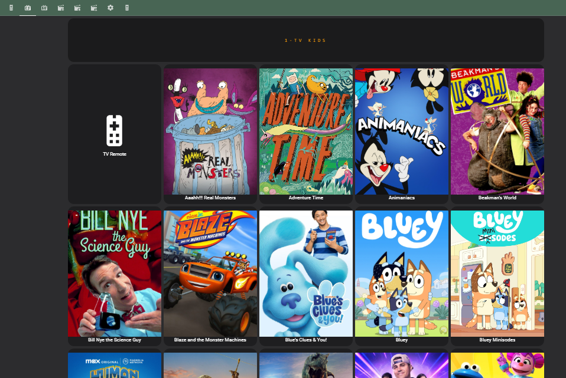

# HassJellyBoard
What if you had a tablet next to your TV running Home Assistant and it listed all your Jellyfin content?

What if your kid could walk up, tap Bluey, and get random episodes without needing your assistance?

What if the Lovelace UI rebuilt automatically when your Jellyfin library changed?




**HassJellyBoard** is a lightweight Python web server that connects **Home Assistant** and **Jellyfin** to create a fast, family-friendly TV interface with support for random episodes, automatic Home Assistant dashboard generation, and playback automation.

---

# What It Does

The Python server runs continuously in the background and handles several responsibilities:

- **Discovers active Jellyfin sessions**
  - Example: *"Is the Living Room TV currently running the Jellyfin app?"*

- **Listens for Jellyfin webhooks**
  - Requires the Jellyfin **Webhooks** plugin.
  - Receives events such as:
    - `Bluey S01E02 finished`
    - `Bluey S01E03 started`

- **Exposes REST API endpoints**
  - Allows Home Assistant automations and scripts to control playback.

- **Caches every episode of every TV series**
  - Enables instant random episode selection without querying Jellyfin every time.

- **Generates Home Assistant Lovelace YAML dashboards**
  - When libraries change (for example, you add *The Golden Girls*), the server rebuilds the UI automatically so the new show appears.

---

# Playback Flow

When someone selects a show in Home Assistant:

1. The user taps a TV show (for example, **Bluey**).

2. Home Assistant runs the script found in:

   ```
   Examples/HomeAssistant Play TV Script.txt
   ```

3. That script calls one of the REST endpoints provided by HassJellyBoard:

   ```
   Examples/HomeAssistant Rest Commands.txt
   ```

4. HassJellyBoard looks up the show in its local cache and retrieves every episode ID.

5. A random episode is selected.

6. HassJellyBoard asks Jellyfin for the active playback session.

   Example:

   > "What's the Session ID for the Living Room TV?"

7. Jellyfin returns the session ID.

8. HassJellyBoard sends Jellyfin a playback command:

   > "Play Episode ABC on Session XYZ."

---

# Why Cache Episodes?

Without caching, every button press would require:

- querying Jellyfin for every episode in the series
- waiting for the response
- selecting a random episode

Instead, HassJellyBoard periodically downloads metadata for **all TV episodes** and stores it locally.

Random playback then becomes an instant lookup.

---

# Keeping the Cache Updated

The server exposes REST endpoints that rebuild the cache.

See:

```
Examples/HomeAssistant Rest Commands.txt
```

I simply call these endpoints from Home Assistant automations every **4 hours**.

There's also a manual "Refresh Cache" button in my dashboard, although I rarely need it.

---

# Building the Home Assistant UI

HassJellyBoard can automatically generate Lovelace YAML dashboards.

When instructed:

1. It asks Jellyfin for every series in a library.
2. Downloads each show's artwork.
3. Generates a Lovelace YAML file containing tiles for every show.
4. Uses SMB file sharing to overwrite the existing YAML file on Home Assistant.

The output location is configured using the `OUTPUT_DIR` variable in the Python application.

The REST endpoints used for rebuilding the UI are documented in:

```
Examples/HomeAssistant Rest Commands.txt
```

---

# Requirements

- Jellyfin
- Jellyfin **Webhooks** plugin
- Jellyfin API token
- Home Assistant
- Home Assitant long-lived access token
- Home Assistant SMB share accessible from the Python server (for Lovelace YAML generation)

---

# Example Files

```
Examples/
├── Lovelace
|   ├── Some sample Lovelace yamls
|   └── Screenshots of the same
├── HomeAssistant Play TV Script.txt
└── HomeAssistant Rest Commands.txt
```

These files contain example Home Assistant scripts and REST commands used to interact with HassJellyBoard.

## Setup
1. Create and activate your Python virtual environment:
   ```
   python -m venv .venv
   .venv\Scripts\activate
   ```
2. Install requirements:
   ```
   pip install -r requirements.txt
   ```
3. Godspeed. Maybe one day I'll figure out a script to automate this, but for now it's going to require brain surgery.